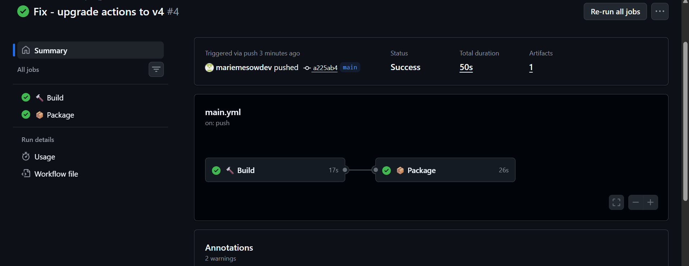

# TP - DevOps - CI/CD GitHub Actions


## 📋 Prérequis

| Outil | Version | Lien |
|-------|---------|------|
| Git | latest | https://git-scm.com |
| Compte GitHub | - | https://github.com |
| Token GitHub | - | Settings → Developer settings → Personal access tokens |
| vagrant-scp | latest | `vagrant plugin install vagrant-scp` |

---

## 🏗️ Architecture CI/CD

```
+------------------+       push        +------------------+
|   Dev (PC)       | ----------------> |   GitHub Repo    |
|   studentapi     |                   |   DEVOPS         |
+------------------+                   +--------+---------+
                                                |
                                         trigger pipeline
                                                |
                                   +------------v-----------+
                                   |   GitHub Actions       |
                                   |  +------------------+  |
                                   |  |  Job: 🔨 Build   |  |
                                   |  +------------------+  |
                                   |           |            |
                                   |  +--------v---------+  |
                                   |  |  Job: 📦 Package |  |
                                   |  +------------------+  |
                                   |  | Artifact: JAR ✅ |  |
                                   |  +------------------+  |
                                   +------------------------+
```

---

## 🚀 Étapes

### 1. Créer le repo sur GitHub

1. Aller sur https://github.com
2. Cliquer sur **"New repository"**
3. Nom : `DEVOPS`
4. Visibilité : **Public**
5. **Ne pas cocher** "Initialize with README"
6. Cliquer **"Create repository"**

---

### 2. Créer un token GitHub

1. Aller sur https://github.com/settings/tokens
2. Cliquer **"Generate new token (classic)"**
3. Cocher `repo`
4. Cliquer **"Generate token"**
5. **Copier le token** (il ne s'affiche qu'une fois !)

---

### 3. Copier le projet depuis la VM

```powershell
# Installer le plugin vagrant-scp
vagrant plugin install vagrant-scp

# Copier le projet depuis server-back
cd tp3-devops
vagrant scp server-back:/home/vagrant/studentapi .
```

---

### 4. Pusher sur GitHub

```powershell
cd C:/Users/elitebook/Desktop/DEVOPSTPSARENDRE

git init
git add tp1-devops/ tp2-devops/ tp3-devops/
git commit -m "Initial commit - TP1 TP2 TP3 DevOps"
git remote add origin https://github.com/TON_USERNAME/DEVOPS.git
git branch -M main
git push -u origin main
```

> ⚠️ Quand Git demande le mot de passe, entrer le **token GitHub** et non le mot de passe du compte.

---

### 5. Corriger les submodules

Si `tp3-devops` ou `studentapi` apparaît comme submodule sur GitHub :

```powershell
# Supprimer le .git interne
Remove-Item -Recurse -Force tp3-devops\studentapi\.git -ErrorAction SilentlyContinue

# Supprimer du cache git
git rm --cached tp3-devops/studentapi

# Réajouter comme dossier normal
git add tp3-devops/studentapi/
git commit -m "Fix studentapi submodule to regular folder"
git push origin main
```

---

### 6. Créer le fichier GitHub Actions

```powershell
# Créer le dossier workflows
New-Item -ItemType Directory -Force -Path .github/workflows

# Créer le fichier
code .github/workflows/main.yml
```

Contenu du fichier `.github/workflows/main.yml` :

```yaml
name: CI - StudentAPI Spring Boot

on:
  push:
    branches: [ main ]
  pull_request:
    branches: [ main ]

jobs:

  build:
    name: 🔨 Build
    runs-on: ubuntu-latest
    steps:
      - uses: actions/checkout@v4

      - name: ☕ Setup JDK 17
        uses: actions/setup-java@v4
        with:
          java-version: '17'
          distribution: 'temurin'

      - name: 🔨 Build
        run: |
          cd tp3-devops/studentapi
          mvn clean compile

  package:
    name: 📦 Package
    runs-on: ubuntu-latest
    needs: build
    steps:
      - uses: actions/checkout@v4

      - name: ☕ Setup JDK 17
        uses: actions/setup-java@v4
        with:
          java-version: '17'
          distribution: 'temurin'

      - name: 📦 Package
        run: |
          cd tp3-devops/studentapi
          mvn clean package -DskipTests

      - name: 📤 Upload JAR
        uses: actions/upload-artifact@v4
        with:
          name: studentapi-jar
          path: tp3-devops/studentapi/target/*.jar
```

### 7. Pusher le workflow

```powershell
cd C:/Users/elitebook/Desktop/DEVOPSTPSARENDRE

git add .github/workflows/main.yml
git commit -m "Add GitHub Actions CI workflow"
git push origin main
```

---

## ✅ Vérification du Pipeline

1. Aller sur **https://github.com/TON_USERNAME/DEVOPS**
2. Cliquer sur l'onglet **"Actions"**
3. Vérifier que les 2 jobs passent au vert :

```
🔨 Build ✅ (17s) → 📦 Package ✅ (26s)
```

### Relancer un pipeline manuellement

```powershell
git commit --allow-empty -m "Trigger CI pipeline"
git push origin main
```

---

## 📦 Jobs du Pipeline

| Job | Description | Durée |
|-----|-------------|-------|
| 🔨 Build | Compilation du code Java | ~17s |
| 📦 Package | Création du JAR exécutable | ~26s |

---

## 🔑 Points importants

| Problème | Solution |
|----------|----------|
| Submodule Git | `git rm --cached` + supprimer `.git` interne |
| actions/upload-artifact@v3 déprécié | Mettre à jour vers `@v4` |
| Mauvais répertoire Maven | Utiliser `cd tp3-devops/studentapi` dans le `run` |
| Token GitHub | Utiliser un Personal Access Token (classic) avec scope `repo` |

---

## 📁 Structure du projet

```
DEVOPS/
│
├── .github/
│   └── workflows/
│       └── main.yml          # Pipeline GitHub Actions
│
├── tp1-devops/
│   ├── Vagrantfile
│   ├── deploy.sh
│   └── studentapp/
│
├── tp2-devops/
│   ├── Vagrantfile
│   └── studentapp/
│
└── tp3-devops/
    ├── Vagrantfile
    ├── README.md
    └── studentapi/           # Projet Spring Boot
        ├── pom.xml
        └── src/
            └── main/
                ├── java/com/tp3/
                │   ├── StudentApiApplication.java
                │   ├── model/Student.java
                │   ├── repository/StudentRepository.java
                │   └── controller/StudentController.java
                └── resources/
                    └── application.properties
```
