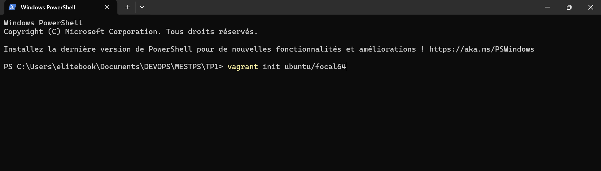
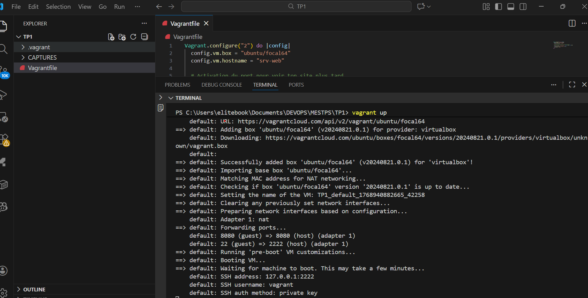
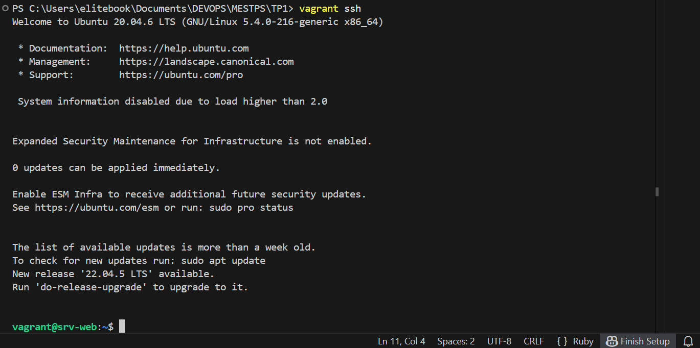
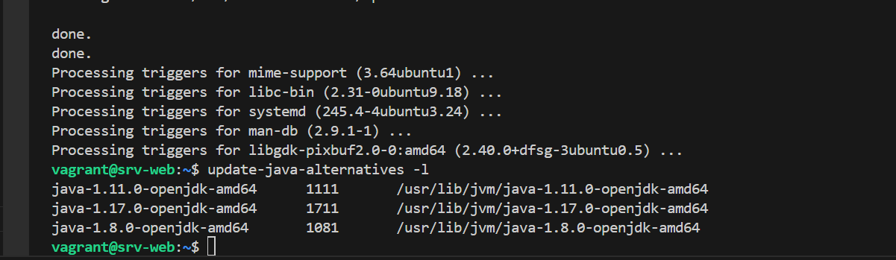
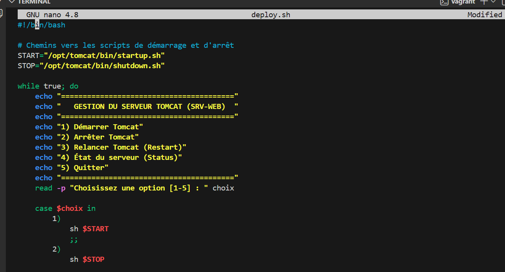

# TP1 - DevOps - Virtualisation - Linux

## Prérequis

| Outil | Version | Lien |
|-------|---------|------|
| VirtualBox | 6.x+ | https://www.virtualbox.org |
| Vagrant | 2.x+ | https://www.vagrantup.com |
| Git Bash (Windows) | latest | https://git-scm.com |

---

## Architecture

```
+-------------------+
|      srv-web      |
|  192.168.56.40    |
|                   |
|  - JDK 8/11/17   |
|  - Tomcat 9       |
|  - studentapp.war |
|  - deploy.sh      |
+-------------------+
```

---

## Démarrage rapide

### 1. Créer le projet

```bash
mkdir tp1-devops
cd tp1-devops
vagrant init ubuntu/focal64
nano Vagrantfile
```


### 2. Configurer le Vagrantfile

```ruby
Vagrant.configure("2") do |config|

  config.vm.define "srv-web" do |web|
    web.vm.box = "ubuntu/focal64"
    web.vm.hostname = "srv-web"
    web.vm.network "private_network", ip: "192.168.56.40"
    web.vm.provider "virtualbox" do |vb|
      vb.memory = "1024"
      vb.cpus = 1
    end
  end

end

```

### 3. Lancer la VM

```bash
vagrant up
vagrant status
```

### 4. Connexion SSH

```bash
vagrant ssh srv-web
```

---

##  Installation de JDK 8, 11 et 17

```bash
sudo apt update && sudo apt upgrade -y

sudo apt install -y openjdk-8-jdk
sudo apt install -y openjdk-11-jdk
sudo apt install -y openjdk-17-jdk

# Vérifier les versions installées
update-java-alternatives --list

# Choisir Java 11 comme version active
sudo update-alternatives --config java
java -version
```

---

## Installation de Tomcat 9

```bash
# Créer l'utilisateur tomcat
sudo useradd -m -U -d /opt/tomcat -s /bin/false tomcat

# Télécharger Tomcat 9
cd /tmp
wget https://archive.apache.org/dist/tomcat/tomcat-9/v9.0.82/bin/apache-tomcat-9.0.82.tar.gz

# Extraire et installer
sudo tar -xzf apache-tomcat-9.0.82.tar.gz -C /opt/tomcat/
sudo ln -s /opt/tomcat/apache-tomcat-9.0.82 /opt/tomcat/latest

# Permissions
sudo chown -R tomcat: /opt/tomcat/apache-tomcat-9.0.82
sudo chmod -R 755 /opt/tomcat/apache-tomcat-9.0.82/
sudo chmod +x /opt/tomcat/apache-tomcat-9.0.82/bin/*.sh
```

### Créer le service systemd

```bash
sudo nano /etc/systemd/system/tomcat.service
```

```ini
[Unit]
Description=Tomcat 9
After=network.target

[Service]
Type=forking
User=tomcat
Group=tomcat
Environment="JAVA_HOME=/usr/lib/jvm/java-11-openjdk-amd64"
Environment="CATALINA_HOME=/opt/tomcat/latest"
ExecStart=/opt/tomcat/latest/bin/startup.sh
ExecStop=/opt/tomcat/latest/bin/shutdown.sh
Restart=on-failure

[Install]
WantedBy=multi-user.target
```

```bash
sudo systemctl daemon-reload
sudo systemctl enable tomcat
sudo systemctl start tomcat
sudo systemctl status tomcat
```

**Accès Tomcat :** http://192.168.56.40:8080

---

##  Déploiement de l'application

### Installer Maven et créer le projet

```bash
sudo apt install -y maven

cd ~
mvn archetype:generate \
  -DgroupId=com.tp1 \
  -DartifactId=studentapp \
  -DarchetypeArtifactId=maven-archetype-webapp \
  -DinteractiveMode=false

cd studentapp
```

### Builder et déployer

```bash
mvn clean package

sudo cp target/studentapp.war /opt/tomcat/latest/webapps/
sudo chown tomcat: /opt/tomcat/latest/webapps/studentapp.war
sudo systemctl restart tomcat
```

**Accès application :** http://192.168.56.40:8080/studentapp

---

##  Script deploy.sh

```bash
nano ~/deploy.sh
chmod +x ~/deploy.sh
sudo ~/deploy.sh
```

### Fonctionnalités du menu

| Option | Description |
|--------|-------------|
| 1 | ▶️ Démarrer Tomcat |
| 2 | ⏹️ Arrêter Tomcat |
| 3 | 🔄 Redémarrer Tomcat |
| 4 | 📊 Statut de Tomcat |
| 5 | 📦 Déployer une application WAR |
| 6 | 📋 Voir les logs |
| 0 | 🚪 Quitter |

---

##  Tests

```bash
# Tester Tomcat
curl http://192.168.56.40:8080

# Tester l'application
curl http://192.168.56.40:8080/studentapp

# Lancer le menu de déploiement
sudo ~/deploy.sh
```

---

##  Commandes Vagrant utiles

| Commande | Description |
|----------|-------------|
| `vagrant up` | Démarrer la VM |
| `vagrant halt` | Éteindre la VM |
| `vagrant status` | Voir l'état de la VM |
| `vagrant ssh srv-web` | Se connecter à srv-web |
| `vagrant destroy` | Supprimer la VM |
| `vagrant reload` | Redémarrer la VM |

---

## Structure du projet

```
tp1-devops/
│
├── Vagrantfile
├── deploy.sh
│
└── studentapp/
    ├── pom.xml
    └── src/
        └── main/
            └── webapp/
                └── index.jsp
```
